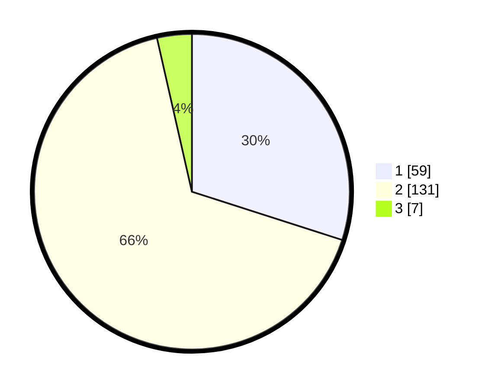

# Hasil

## Grafik

## Tabel

| No. | Nama Paslon    | Suara | Suara (raw) | Persentase |
|:--- |:-------------- | -----:| -----------:| ----------:|
| 1   | ANIES MUHAIMIN | 59    | [59][p-1]   | 29,95      |
| 2   | PRABOWO GIBRAN | 131   | [131][p-2]  | 66,50      |
| 3   | GANJAR MAHFUD  | 7     | [7][p-3]    | 3,55       |

[p-1]: https://github.com/gigit-pemilu/pemilu-2024-71-sulawesi-utara/blob/main/pilpres/hitung-suara/sub/71-sulawesi-utara/sub/08-bolaang-mongondow-utara/sub/03-bolangitang-timur/sub/2002-nunuka/sub/002-tps/sub/paslon-1.txt
[p-2]: https://github.com/gigit-pemilu/pemilu-2024-71-sulawesi-utara/blob/main/pilpres/hitung-suara/sub/71-sulawesi-utara/sub/08-bolaang-mongondow-utara/sub/03-bolangitang-timur/sub/2002-nunuka/sub/002-tps/sub/paslon-2.txt
[p-3]: https://github.com/gigit-pemilu/pemilu-2024-71-sulawesi-utara/blob/main/pilpres/hitung-suara/sub/71-sulawesi-utara/sub/08-bolaang-mongondow-utara/sub/03-bolangitang-timur/sub/2002-nunuka/sub/002-tps/sub/paslon-3.txt

## Foto C Plano

https://sirekap-obj-formc.kpu.go.id/caaf/pemilu/ppwp/71/08/03/20/02/7108032002002-20240215-044237--9842cadf-ac08-4ee8-873d-de4dffe2c603.jpg

https://sirekap-obj-formc.kpu.go.id/caaf/pemilu/ppwp/71/08/03/20/02/7108032002002-20240215-044508--d7723a2f-d9a9-498e-8256-77391ba279e4.jpg

https://sirekap-obj-formc.kpu.go.id/caaf/pemilu/ppwp/71/08/03/20/02/7108032002002-20240215-044712--ccd43c3a-9d2a-4172-998b-527926c2bd89.jpg

## Metadata

| Key        | Value               |
| ---------- | ------------------- |
| Time Stamp | 2024-02-16 23:00:00 |

