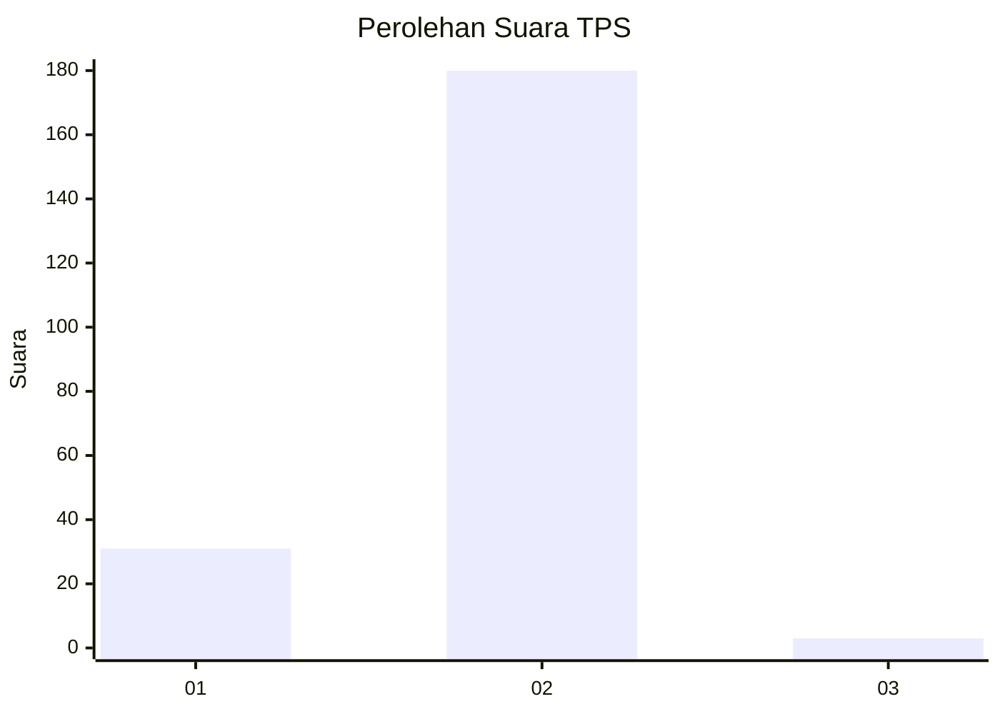
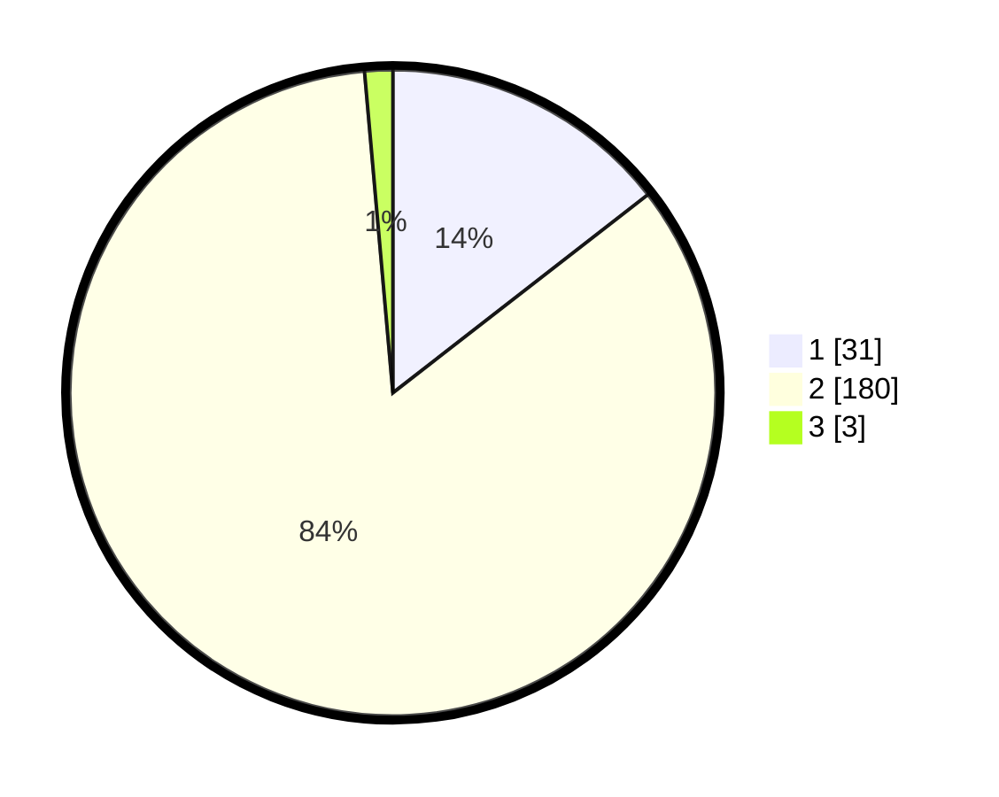

# Hasil

## Grafik

## Tabel

| No. | Nama Paslon    | Suara | Suara (raw) | Persentase |
|:--- |:-------------- | -----:| -----------:| ----------:|
| 1   | ANIES MUHAIMIN | 31    | [31][p-1]   | 14,49      |
| 2   | PRABOWO GIBRAN | 180   | [180][p-2]  | 84,11      |
| 3   | GANJAR MAHFUD  | 3     | [3][p-3]    | 1,40       |

[p-1]: https://github.com/gigit-pemilu/pemilu-2024-71-sulawesi-utara/blob/main/pilpres/hitung-suara/sub/71-sulawesi-utara/sub/08-bolaang-mongondow-utara/sub/04-bolangitang-barat/sub/2002-ollot/sub/002-tps/sub/paslon-1.txt
[p-2]: https://github.com/gigit-pemilu/pemilu-2024-71-sulawesi-utara/blob/main/pilpres/hitung-suara/sub/71-sulawesi-utara/sub/08-bolaang-mongondow-utara/sub/04-bolangitang-barat/sub/2002-ollot/sub/002-tps/sub/paslon-2.txt
[p-3]: https://github.com/gigit-pemilu/pemilu-2024-71-sulawesi-utara/blob/main/pilpres/hitung-suara/sub/71-sulawesi-utara/sub/08-bolaang-mongondow-utara/sub/04-bolangitang-barat/sub/2002-ollot/sub/002-tps/sub/paslon-3.txt

## Foto C Plano

https://sirekap-obj-formc.kpu.go.id/351a/pemilu/ppwp/71/08/04/20/02/7108042002002-20240215-104403--a8fd5588-ae4a-466c-8cff-3e90470b792e.jpg

https://sirekap-obj-formc.kpu.go.id/351a/pemilu/ppwp/71/08/04/20/02/7108042002002-20240215-110232--f1099f54-356c-48a7-b2a3-39dabdedcb85.jpg

https://sirekap-obj-formc.kpu.go.id/351a/pemilu/ppwp/71/08/04/20/02/7108042002002-20240215-105617--3b6931b4-a00d-49da-85dd-fea0cf0a2632.jpg

## Metadata

| Key        | Value               |
| ---------- | ------------------- |
| Time Stamp | 2024-02-15 20:30:46 |

