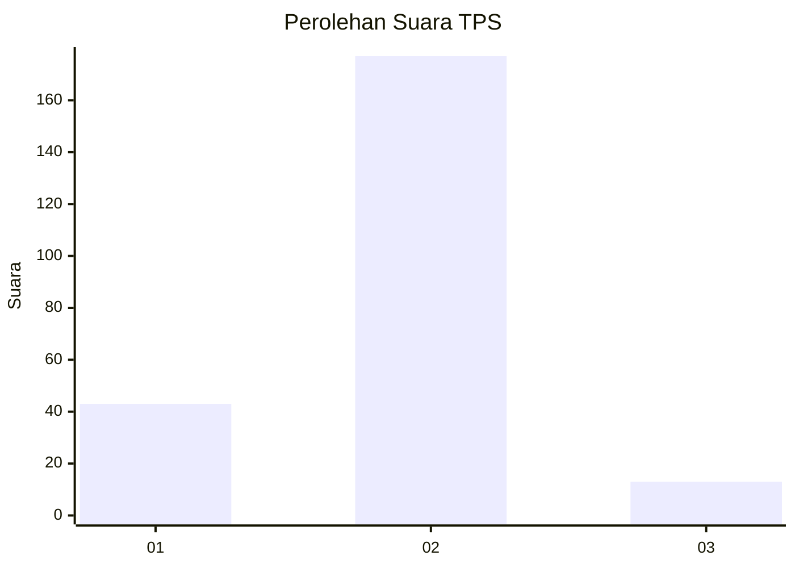
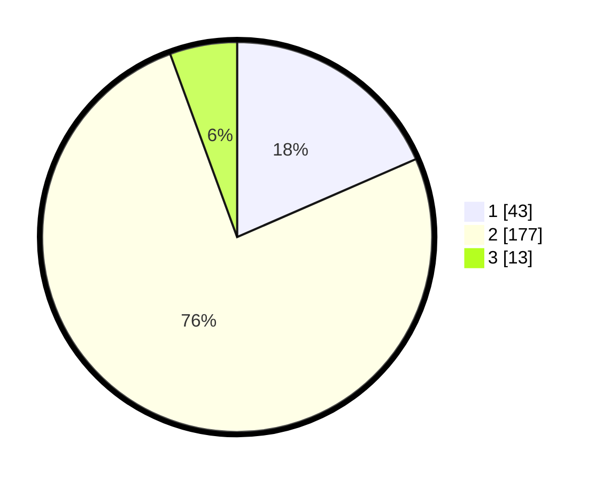

# Hasil

## Grafik

## Tabel

| No. | Nama Paslon    | Suara | Suara (raw) | Persentase |
|:--- |:-------------- | -----:| -----------:| ----------:|
| 1   | ANIES MUHAIMIN | 43    | [43][p-1]   | 18,45      |
| 2   | PRABOWO GIBRAN | 177   | [177][p-2]  | 75,97      |
| 3   | GANJAR MAHFUD  | 13    | [13][p-3]   | 5,58       |

[p-1]: https://github.com/gigit-pemilu/pemilu-2024-71-sulawesi-utara/blob/main/pilpres/hitung-suara/sub/71-sulawesi-utara/sub/10-bolaang-mongondow-timur/sub/01-tutuyan/sub/2003-tutuyan/sub/006-tps/sub/paslon-1.txt
[p-2]: https://github.com/gigit-pemilu/pemilu-2024-71-sulawesi-utara/blob/main/pilpres/hitung-suara/sub/71-sulawesi-utara/sub/10-bolaang-mongondow-timur/sub/01-tutuyan/sub/2003-tutuyan/sub/006-tps/sub/paslon-2.txt
[p-3]: https://github.com/gigit-pemilu/pemilu-2024-71-sulawesi-utara/blob/main/pilpres/hitung-suara/sub/71-sulawesi-utara/sub/10-bolaang-mongondow-timur/sub/01-tutuyan/sub/2003-tutuyan/sub/006-tps/sub/paslon-3.txt

## Foto C Plano

https://sirekap-obj-formc.kpu.go.id/77b5/pemilu/ppwp/71/10/01/20/03/7110012003006-20240226-200049--3c54b506-7334-49c7-8240-491b8a7f2cae.jpg

https://sirekap-obj-formc.kpu.go.id/77b5/pemilu/ppwp/71/10/01/20/03/7110012003006-20240226-200150--8e62b2b0-a76a-47fe-9698-80af0d2c241e.jpg

https://sirekap-obj-formc.kpu.go.id/77b5/pemilu/ppwp/71/10/01/20/03/7110012003006-20240226-200340--bd93092b-a93b-4e22-bb13-8d591f9d9d75.jpg

## Metadata

| Key        | Value               |
| ---------- | ------------------- |
| Time Stamp | 2024-03-01 23:00:00 |

