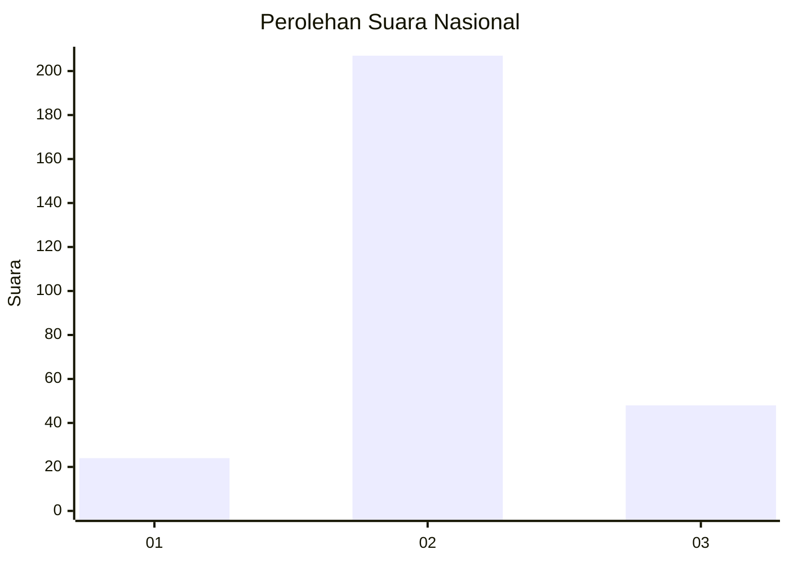
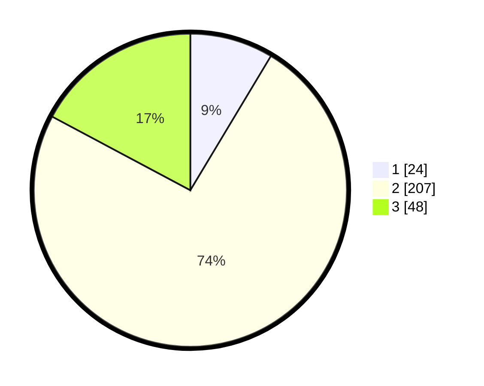

# Hasil

## Grafik

## Tabel

| No. | Nama Paslon    | Suara | Suara (raw) | Persentase |
|:--- |:-------------- | -----:| -----------:| ----------:|
| 1   | ANIES MUHAIMIN | 24    | [24][p-1]   | 8,60       |
| 2   | PRABOWO GIBRAN | 207   | [207][p-2]  | 74,19      |
| 3   | GANJAR MAHFUD  | 48    | [48][p-3]   | 17,20      |

[p-1]: https://github.com/gigit-pemilu/pemilu-2024/blob/main/pilpres/hitung-suara/sub/71-sulawesi-utara/sub/10-bolaang-mongondow-timur/sub/04-modayag/sub/2012-modayag-iii/sub/001-tps/sub/paslon-1.txt
[p-2]: https://github.com/gigit-pemilu/pemilu-2024/blob/main/pilpres/hitung-suara/sub/71-sulawesi-utara/sub/10-bolaang-mongondow-timur/sub/04-modayag/sub/2012-modayag-iii/sub/001-tps/sub/paslon-2.txt
[p-3]: https://github.com/gigit-pemilu/pemilu-2024/blob/main/pilpres/hitung-suara/sub/71-sulawesi-utara/sub/10-bolaang-mongondow-timur/sub/04-modayag/sub/2012-modayag-iii/sub/001-tps/sub/paslon-3.txt

## Foto C Plano

https://sirekap-obj-formc.kpu.go.id/6da4/pemilu/ppwp/71/10/04/20/12/7110042012001-20240302-164445--d13a81ec-19f6-4573-9e06-aabab8cfd6d8.jpg

https://sirekap-obj-formc.kpu.go.id/6da4/pemilu/ppwp/71/10/04/20/12/7110042012001-20240216-115745--33736fb6-6f1e-4a36-93e3-db13c96756d5.jpg

https://sirekap-obj-formc.kpu.go.id/6da4/pemilu/ppwp/71/10/04/20/12/7110042012001-20240216-115752--cc1c4ac9-c58e-46e7-90d3-0e5fc0dfd312.jpg

## Metadata

| Key        | Value               |
| ---------- | ------------------- |
| Time Stamp | 2024-03-02 17:00:00 |

