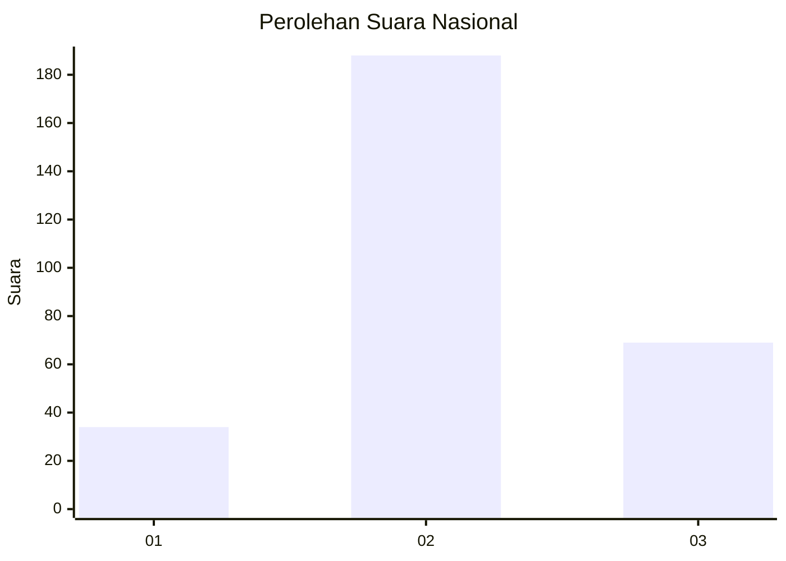
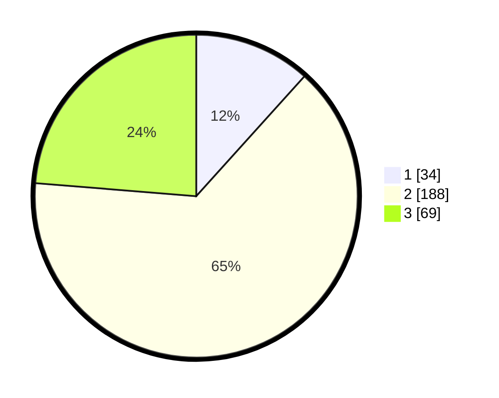

# Hasil

## Grafik

## Tabel

| No. | Nama Paslon    | Suara | Suara (raw) | Persentase |
|:--- |:-------------- | -----:| -----------:| ----------:|
| 1   | ANIES MUHAIMIN | 34    | [34][p-1]   | 11,68      |
| 2   | PRABOWO GIBRAN | 188   | [188][p-2]  | 64,60      |
| 3   | GANJAR MAHFUD  | 69    | [69][p-3]   | 23,71      |

[p-1]: https://github.com/gigit-pemilu/pemilu-2024/blob/main/pilpres/hitung-suara/sub/71-sulawesi-utara/sub/10-bolaang-mongondow-timur/sub/04-modayag/sub/2012-modayag-iii/sub/003-tps/sub/paslon-1.txt
[p-2]: https://github.com/gigit-pemilu/pemilu-2024/blob/main/pilpres/hitung-suara/sub/71-sulawesi-utara/sub/10-bolaang-mongondow-timur/sub/04-modayag/sub/2012-modayag-iii/sub/003-tps/sub/paslon-2.txt
[p-3]: https://github.com/gigit-pemilu/pemilu-2024/blob/main/pilpres/hitung-suara/sub/71-sulawesi-utara/sub/10-bolaang-mongondow-timur/sub/04-modayag/sub/2012-modayag-iii/sub/003-tps/sub/paslon-3.txt

## Foto C Plano

https://sirekap-obj-formc.kpu.go.id/b803/pemilu/ppwp/71/10/04/20/12/7110042012003-20240302-212612--712a7cc0-57c4-45b9-a1db-f66a6d26e8a8.jpg

https://sirekap-obj-formc.kpu.go.id/b803/pemilu/ppwp/71/10/04/20/12/7110042012003-20240214-185317--5dd43c09-2899-459c-864c-72b3e902dca1.jpg

https://sirekap-obj-formc.kpu.go.id/b803/pemilu/ppwp/71/10/04/20/12/7110042012003-20240214-191231--3ae6ed82-814b-46b0-86fc-88d0295c6f43.jpg

## Metadata

| Key        | Value               |
| ---------- | ------------------- |
| Time Stamp | 2024-03-02 22:00:00 |

