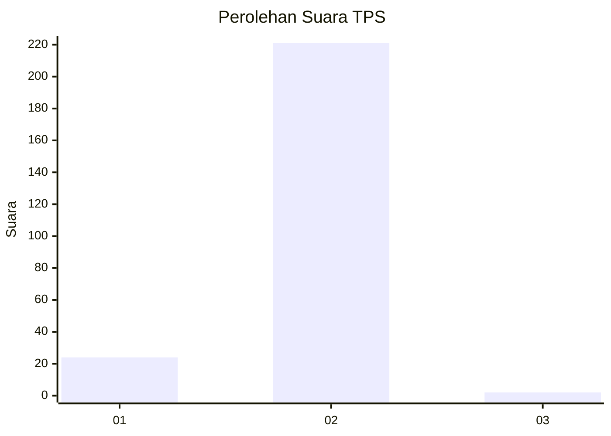
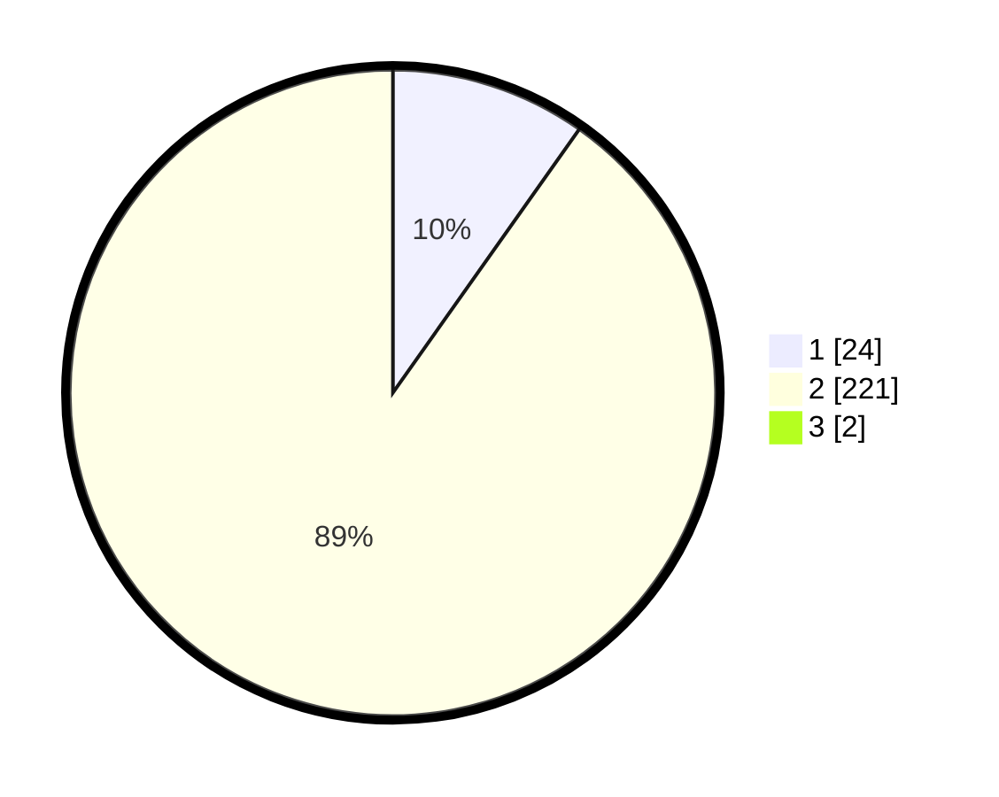

# Hasil

## Grafik

## Tabel

| No. | Nama Paslon    | Suara | Suara (raw) | Persentase |
|:--- |:-------------- | -----:| -----------:| ----------:|
| 1   | ANIES MUHAIMIN | 24    | [24][p-1]   | 9,72       |
| 2   | PRABOWO GIBRAN | 221   | [221][p-2]  | 89,47      |
| 3   | GANJAR MAHFUD  | 2     | [2][p-3]    | 0,81       |

[p-1]: https://github.com/gigit-pemilu/pemilu-2024-71-sulawesi-utara/blob/main/pilpres/hitung-suara/sub/71-sulawesi-utara/sub/10-bolaang-mongondow-timur/sub/06-motongkad/sub/2001-motongkad-utara/sub/003-tps/sub/paslon-1.txt
[p-2]: https://github.com/gigit-pemilu/pemilu-2024-71-sulawesi-utara/blob/main/pilpres/hitung-suara/sub/71-sulawesi-utara/sub/10-bolaang-mongondow-timur/sub/06-motongkad/sub/2001-motongkad-utara/sub/003-tps/sub/paslon-2.txt
[p-3]: https://github.com/gigit-pemilu/pemilu-2024-71-sulawesi-utara/blob/main/pilpres/hitung-suara/sub/71-sulawesi-utara/sub/10-bolaang-mongondow-timur/sub/06-motongkad/sub/2001-motongkad-utara/sub/003-tps/sub/paslon-3.txt

## Foto C Plano

https://sirekap-obj-formc.kpu.go.id/861f/pemilu/ppwp/71/10/06/20/01/7110062001003-20240227-194717--4019426e-1a84-43ac-8f78-39c3b8bfc0e2.jpg

https://sirekap-obj-formc.kpu.go.id/861f/pemilu/ppwp/71/10/06/20/01/7110062001003-20240214-202120--662accc6-2e42-4020-ab1a-ec1675010c97.jpg

https://sirekap-obj-formc.kpu.go.id/861f/pemilu/ppwp/71/10/06/20/01/7110062001003-20240214-202259--d18774b3-eb25-4b85-979d-e60476710d34.jpg

## Metadata

| Key        | Value               |
| ---------- | ------------------- |
| Time Stamp | 2024-02-27 20:00:00 |

