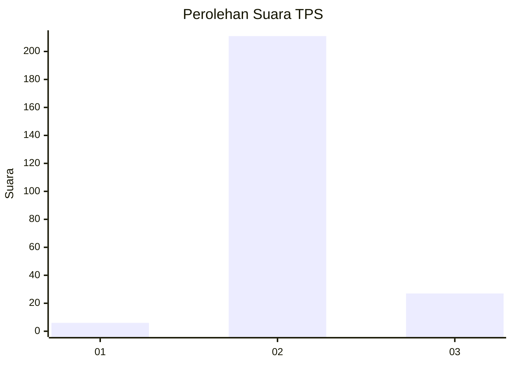
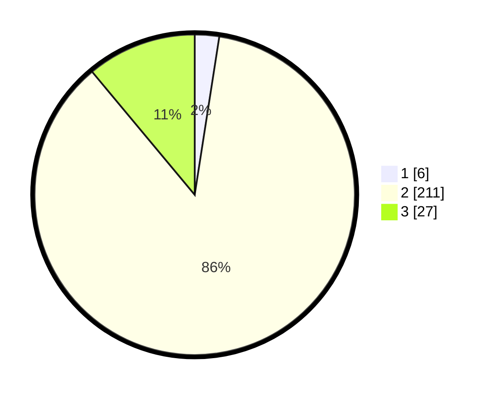

# Hasil

## Grafik

## Tabel

| No. | Nama Paslon    | Suara | Suara (raw) | Persentase |
|:--- |:-------------- | -----:| -----------:| ----------:|
| 1   | ANIES MUHAIMIN | 6     | [6][p-1]    | 2,46       |
| 2   | PRABOWO GIBRAN | 211   | [211][p-2]  | 86,48      |
| 3   | GANJAR MAHFUD  | 27    | [27][p-3]   | 11,07      |

[p-1]: https://github.com/gigit-pemilu/pemilu-2024-71-sulawesi-utara/blob/main/pilpres/hitung-suara/sub/71-sulawesi-utara/sub/10-bolaang-mongondow-timur/sub/07-mooat/sub/2002-bongkudai-selatan/sub/002-tps/sub/paslon-1.txt
[p-2]: https://github.com/gigit-pemilu/pemilu-2024-71-sulawesi-utara/blob/main/pilpres/hitung-suara/sub/71-sulawesi-utara/sub/10-bolaang-mongondow-timur/sub/07-mooat/sub/2002-bongkudai-selatan/sub/002-tps/sub/paslon-2.txt
[p-3]: https://github.com/gigit-pemilu/pemilu-2024-71-sulawesi-utara/blob/main/pilpres/hitung-suara/sub/71-sulawesi-utara/sub/10-bolaang-mongondow-timur/sub/07-mooat/sub/2002-bongkudai-selatan/sub/002-tps/sub/paslon-3.txt

## Foto C Plano

https://sirekap-obj-formc.kpu.go.id/6cc4/pemilu/ppwp/71/10/07/20/02/7110072002002-20240218-203115--72b5956b-adfa-481a-9e40-072fa84aea77.jpg

https://sirekap-obj-formc.kpu.go.id/6cc4/pemilu/ppwp/71/10/07/20/02/7110072002002-20240216-154228--f2b25904-01b6-4256-9bf7-bb7325693979.jpg

https://sirekap-obj-formc.kpu.go.id/6cc4/pemilu/ppwp/71/10/07/20/02/7110072002002-20240216-154336--d651cdac-9237-4921-be8a-f81d45fa5bff.jpg

## Metadata

| Key        | Value               |
| ---------- | ------------------- |
| Time Stamp | 2024-02-19 06:16:00 |

