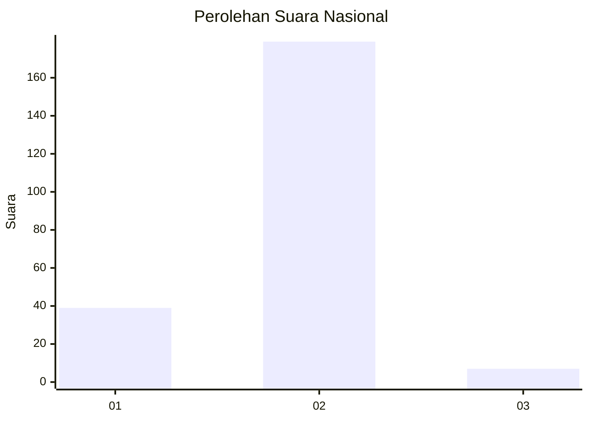
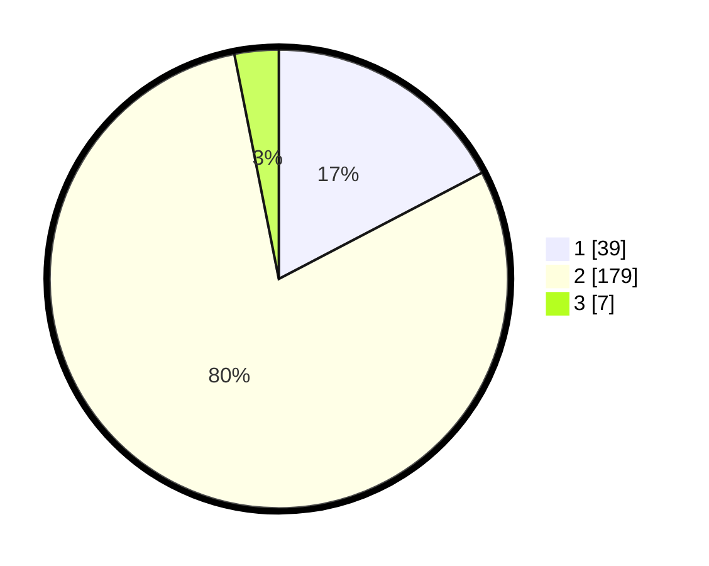

# Hasil

## Grafik

## Tabel

| No. | Nama Paslon    | Suara | Suara (raw) | Persentase |
|:--- |:-------------- | -----:| -----------:| ----------:|
| 1   | ANIES MUHAIMIN | 39    | [39][p-1]   | 17,33      |
| 2   | PRABOWO GIBRAN | 179   | [179][p-2]  | 79,56      |
| 3   | GANJAR MAHFUD  | 7     | [7][p-3]    | 3,11       |

[p-1]: https://github.com/gigit-pemilu/pemilu-2024/blob/main/pilpres/hitung-suara/sub/71-sulawesi-utara/sub/11-bolaang-mongondow-selatan/sub/01-bolaang-uki/sub/2005-salongo/sub/003-tps/sub/paslon-1.txt
[p-2]: https://github.com/gigit-pemilu/pemilu-2024/blob/main/pilpres/hitung-suara/sub/71-sulawesi-utara/sub/11-bolaang-mongondow-selatan/sub/01-bolaang-uki/sub/2005-salongo/sub/003-tps/sub/paslon-2.txt
[p-3]: https://github.com/gigit-pemilu/pemilu-2024/blob/main/pilpres/hitung-suara/sub/71-sulawesi-utara/sub/11-bolaang-mongondow-selatan/sub/01-bolaang-uki/sub/2005-salongo/sub/003-tps/sub/paslon-3.txt

## Foto C Plano

https://sirekap-obj-formc.kpu.go.id/c91a/pemilu/ppwp/71/11/01/20/05/7111012005003-20240215-174340--abd1c0d1-d5a7-4be6-bab7-d120a02bb07c.jpg

https://sirekap-obj-formc.kpu.go.id/c91a/pemilu/ppwp/71/11/01/20/05/7111012005003-20240215-174440--4e0405ea-5a93-4ee3-85ae-f06aec04cbba.jpg

https://sirekap-obj-formc.kpu.go.id/c91a/pemilu/ppwp/71/11/01/20/05/7111012005003-20240215-174303--130cc0ac-2feb-49de-b6e5-3a86fa1aeea8.jpg

## Metadata

| Key        | Value               |
| ---------- | ------------------- |
| Time Stamp | 2024-02-16 14:30:33 |

