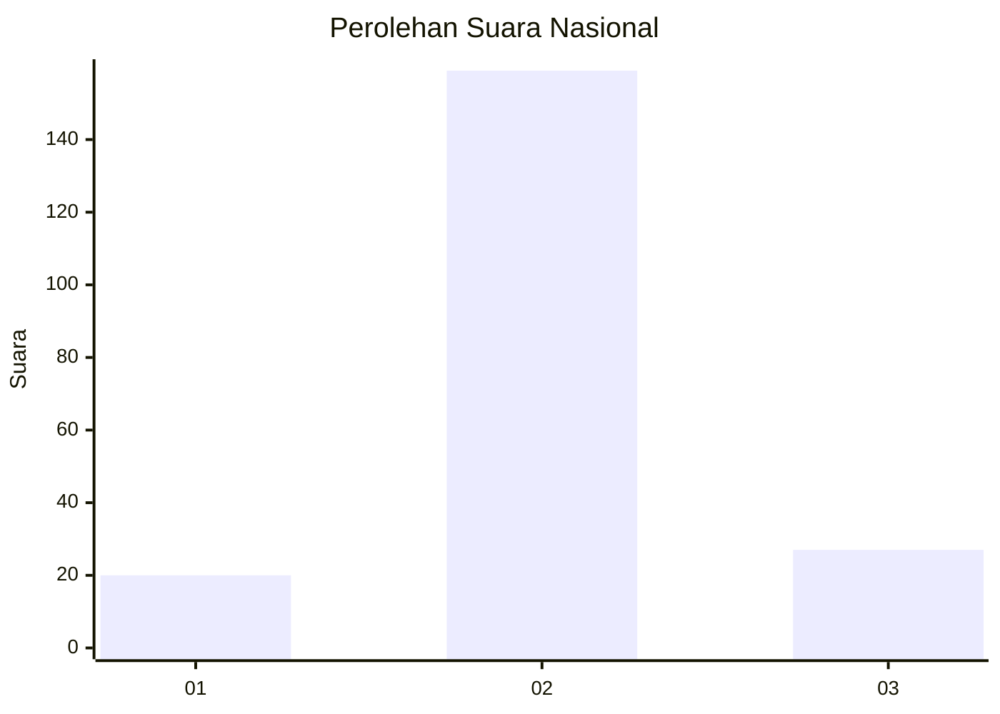
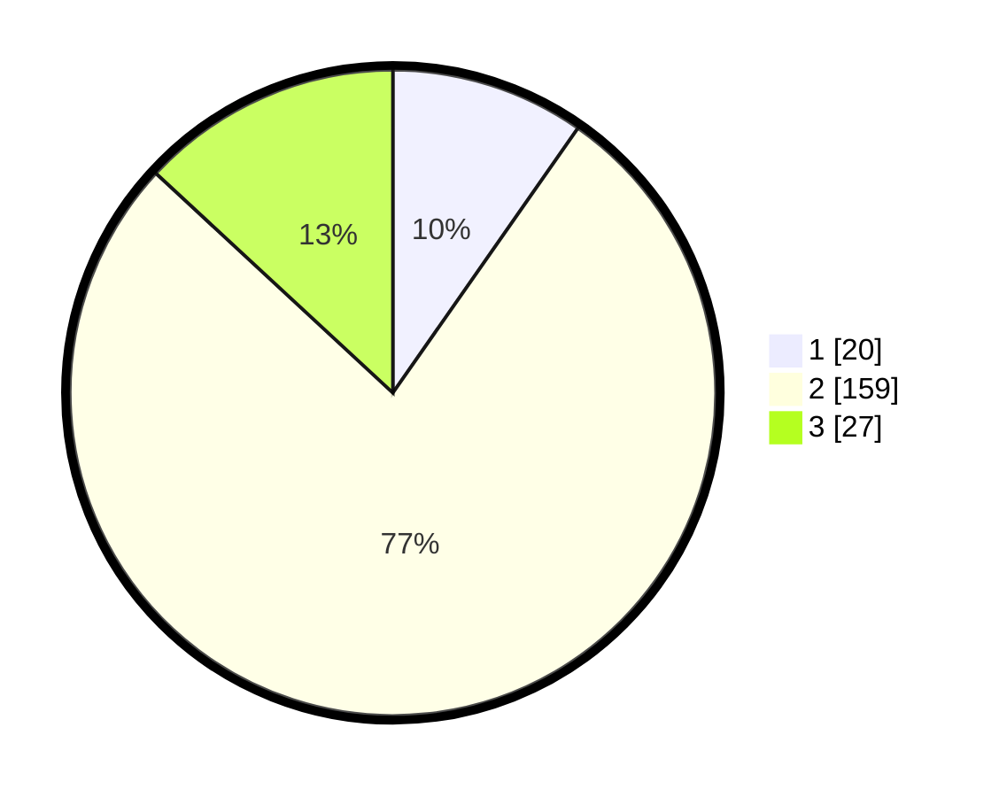

# Hasil

## Grafik

## Tabel

| No. | Nama Paslon    | Suara | Suara (raw) | Persentase |
|:--- |:-------------- | -----:| -----------:| ----------:|
| 1   | ANIES MUHAIMIN | 20    | [20][p-1]   | 9,71       |
| 2   | PRABOWO GIBRAN | 159   | [159][p-2]  | 77,18      |
| 3   | GANJAR MAHFUD  | 27    | [27][p-3]   | 13,11      |

[p-1]: https://github.com/gigit-pemilu/pemilu-2024/blob/main/pilpres/hitung-suara/sub/71-sulawesi-utara/sub/11-bolaang-mongondow-selatan/sub/07-tomini/sub/2002-nunuka-raya/sub/003-tps/sub/paslon-1.txt
[p-2]: https://github.com/gigit-pemilu/pemilu-2024/blob/main/pilpres/hitung-suara/sub/71-sulawesi-utara/sub/11-bolaang-mongondow-selatan/sub/07-tomini/sub/2002-nunuka-raya/sub/003-tps/sub/paslon-2.txt
[p-3]: https://github.com/gigit-pemilu/pemilu-2024/blob/main/pilpres/hitung-suara/sub/71-sulawesi-utara/sub/11-bolaang-mongondow-selatan/sub/07-tomini/sub/2002-nunuka-raya/sub/003-tps/sub/paslon-3.txt

## Foto C Plano

https://sirekap-obj-formc.kpu.go.id/5686/pemilu/ppwp/71/11/07/20/02/7111072002003-20240215-085551--b01e2a0c-d825-48be-82e2-7b8aafe85b20.jpg

https://sirekap-obj-formc.kpu.go.id/5686/pemilu/ppwp/71/11/07/20/02/7111072002003-20240215-090857--3f8c0fb2-50a8-4ad9-8e1a-de48bedcb994.jpg

https://sirekap-obj-formc.kpu.go.id/5686/pemilu/ppwp/71/11/07/20/02/7111072002003-20240215-053146--1162014b-b9fe-486a-93ca-cce0f04c94db.jpg

## Metadata

| Key        | Value               |
| ---------- | ------------------- |
| Time Stamp | 2024-02-16 21:01:00 |

