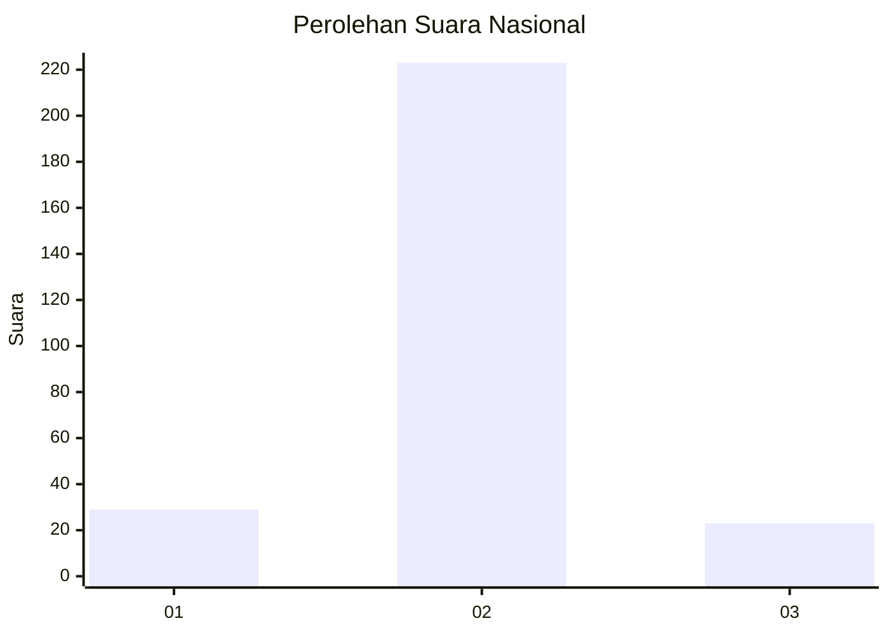
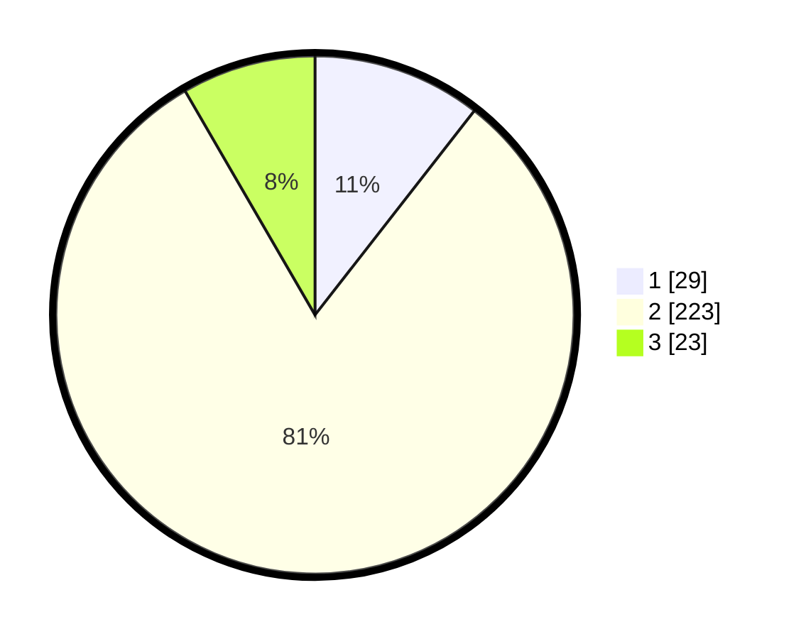

# Hasil

## Grafik

## Tabel

| No. | Nama Paslon    | Suara | Suara (raw) | Persentase |
|:--- |:-------------- | -----:| -----------:| ----------:|
| 1   | ANIES MUHAIMIN | 29    | [29][p-1]   | 10,55      |
| 2   | PRABOWO GIBRAN | 223   | [223][p-2]  | 81,09      |
| 3   | GANJAR MAHFUD  | 23    | [23][p-3]   | 8,36       |

[p-1]: https://github.com/gigit-pemilu/pemilu-2024/blob/main/pilpres/hitung-suara/sub/71-sulawesi-utara/sub/11-bolaang-mongondow-selatan/sub/07-tomini/sub/2004-milangodaa/sub/001-tps/sub/paslon-1.txt
[p-2]: https://github.com/gigit-pemilu/pemilu-2024/blob/main/pilpres/hitung-suara/sub/71-sulawesi-utara/sub/11-bolaang-mongondow-selatan/sub/07-tomini/sub/2004-milangodaa/sub/001-tps/sub/paslon-2.txt
[p-3]: https://github.com/gigit-pemilu/pemilu-2024/blob/main/pilpres/hitung-suara/sub/71-sulawesi-utara/sub/11-bolaang-mongondow-selatan/sub/07-tomini/sub/2004-milangodaa/sub/001-tps/sub/paslon-3.txt

## Foto C Plano

https://sirekap-obj-formc.kpu.go.id/316e/pemilu/ppwp/71/11/07/20/04/7111072004001-20240215-122346--722881eb-743e-46e0-ac68-75b0afedfc25.jpg

https://sirekap-obj-formc.kpu.go.id/316e/pemilu/ppwp/71/11/07/20/04/7111072004001-20240215-122922--2413527e-ddd7-40e0-b3b8-3801117c86a9.jpg

https://sirekap-obj-formc.kpu.go.id/316e/pemilu/ppwp/71/11/07/20/04/7111072004001-20240215-124313--0787be61-2131-4eb7-8870-a94440166579.jpg

## Metadata

| Key        | Value               |
| ---------- | ------------------- |
| Time Stamp | 2024-02-15 17:00:25 |

