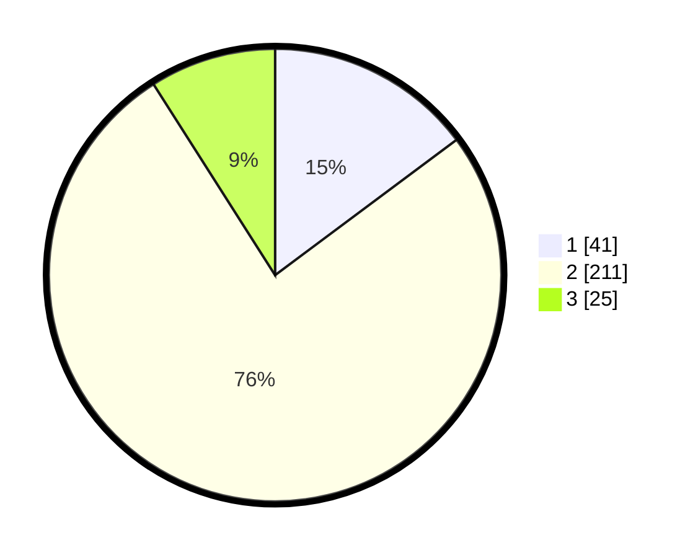

# Hasil

## Grafik

## Tabel

| No. | Nama Paslon    | Suara | Suara (raw) | Persentase |
|:--- |:-------------- | -----:| -----------:| ----------:|
| 1   | ANIES MUHAIMIN | 41    | [41][p-1]   | 14,80      |
| 2   | PRABOWO GIBRAN | 211   | [211][p-2]  | 76,17      |
| 3   | GANJAR MAHFUD  | 25    | [25][p-3]   | 9,03       |

[p-1]: https://github.com/gigit-pemilu/pemilu-2024-71-sulawesi-utara/blob/main/pilpres/hitung-suara/sub/71-sulawesi-utara/sub/11-bolaang-mongondow-selatan/sub/07-tomini/sub/2004-milangodaa/sub/002-tps/sub/paslon-1.txt
[p-2]: https://github.com/gigit-pemilu/pemilu-2024-71-sulawesi-utara/blob/main/pilpres/hitung-suara/sub/71-sulawesi-utara/sub/11-bolaang-mongondow-selatan/sub/07-tomini/sub/2004-milangodaa/sub/002-tps/sub/paslon-2.txt
[p-3]: https://github.com/gigit-pemilu/pemilu-2024-71-sulawesi-utara/blob/main/pilpres/hitung-suara/sub/71-sulawesi-utara/sub/11-bolaang-mongondow-selatan/sub/07-tomini/sub/2004-milangodaa/sub/002-tps/sub/paslon-3.txt

## Foto C Plano

https://sirekap-obj-formc.kpu.go.id/6e03/pemilu/ppwp/71/11/07/20/04/7111072004002-20240215-164559--ca8cde85-4cfa-4118-9aa3-09350c70c664.jpg

https://sirekap-obj-formc.kpu.go.id/6e03/pemilu/ppwp/71/11/07/20/04/7111072004002-20240215-164741--a7e70b36-d808-41d3-b367-fc6871b8ef4e.jpg

https://sirekap-obj-formc.kpu.go.id/6e03/pemilu/ppwp/71/11/07/20/04/7111072004002-20240215-164855--33196c47-5d6d-48ff-976e-35cbc59fc66f.jpg

## Metadata

| Key        | Value               |
| ---------- | ------------------- |
| Time Stamp | 2024-02-16 21:01:00 |

