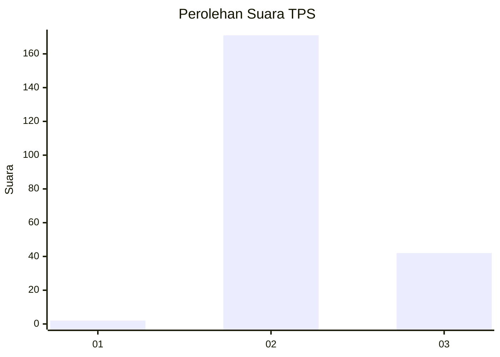
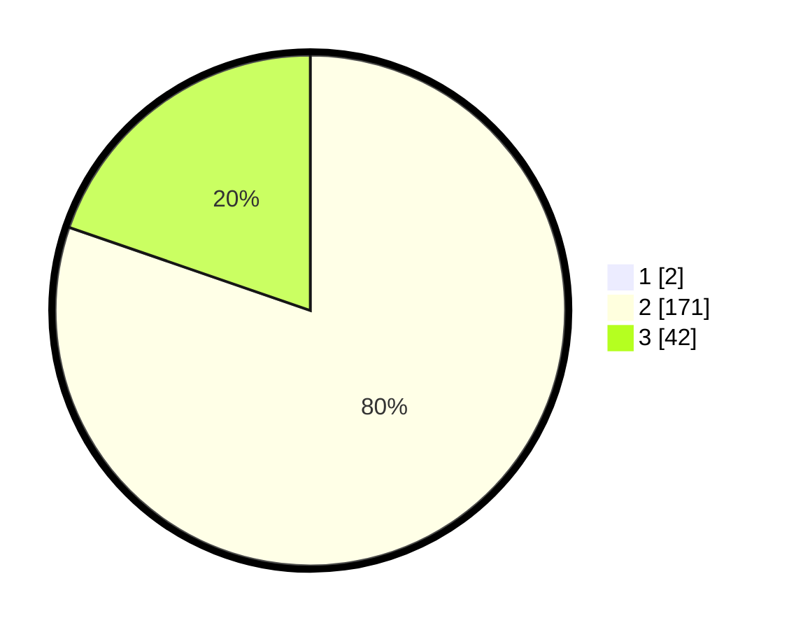

# Hasil

## Grafik

## Tabel

| No. | Nama Paslon    | Suara | Suara (raw) | Persentase |
|:--- |:-------------- | -----:| -----------:| ----------:|
| 1   | ANIES MUHAIMIN | 2     | [2][p-1]    | 0,93       |
| 2   | PRABOWO GIBRAN | 171   | [171][p-2]  | 79,53      |
| 3   | GANJAR MAHFUD  | 42    | [42][p-3]   | 19,53      |

[p-1]: https://github.com/gigit-pemilu/pemilu-2024-71-sulawesi-utara/blob/main/pilpres/hitung-suara/sub/71-sulawesi-utara/sub/71-kota-manado/sub/04-wenang/sub/1001-tikala-kumaraka/sub/007-tps/sub/paslon-1.txt
[p-2]: https://github.com/gigit-pemilu/pemilu-2024-71-sulawesi-utara/blob/main/pilpres/hitung-suara/sub/71-sulawesi-utara/sub/71-kota-manado/sub/04-wenang/sub/1001-tikala-kumaraka/sub/007-tps/sub/paslon-2.txt
[p-3]: https://github.com/gigit-pemilu/pemilu-2024-71-sulawesi-utara/blob/main/pilpres/hitung-suara/sub/71-sulawesi-utara/sub/71-kota-manado/sub/04-wenang/sub/1001-tikala-kumaraka/sub/007-tps/sub/paslon-3.txt

## Foto C Plano

https://sirekap-obj-formc.kpu.go.id/2e8f/pemilu/ppwp/71/71/04/10/01/7171041001007-20240221-140350--c79ee52c-670b-4081-a5ce-9b665aa31fa4.jpg

https://sirekap-obj-formc.kpu.go.id/2e8f/pemilu/ppwp/71/71/04/10/01/7171041001007-20240221-140644--a09b4c57-5365-45e0-a819-314e6e422f0a.jpg

https://sirekap-obj-formc.kpu.go.id/2e8f/pemilu/ppwp/71/71/04/10/01/7171041001007-20240221-140829--971d0feb-6d45-4fe3-99db-a911e13d2f39.jpg

## Metadata

| Key        | Value               |
| ---------- | ------------------- |
| Time Stamp | 2024-02-22 17:00:00 |

