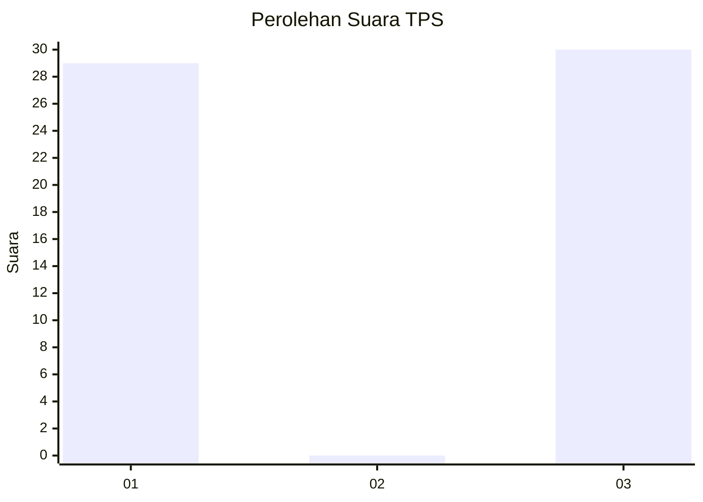
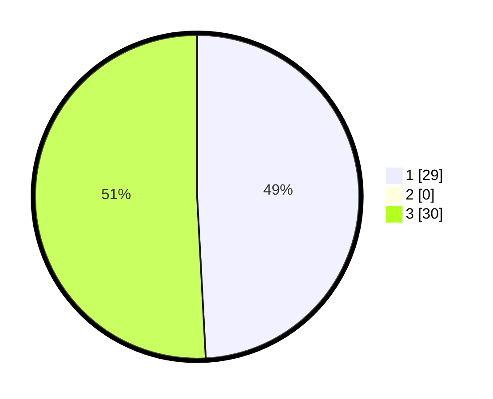

# Hasil

## Grafik

## Tabel

| No. | Nama Paslon    | Suara | Suara (raw) | Persentase |
|:--- |:-------------- | -----:| -----------:| ----------:|
| 1   | ANIES MUHAIMIN | 29    | [29][p-1]   | 49,15      |
| 2   | PRABOWO GIBRAN | 0     | [0][p-2]    | 0,00       |
| 3   | GANJAR MAHFUD  | 30    | [30][p-3]   | 50,85      |

[p-1]: https://github.com/gigit-pemilu/pemilu-2024-71-sulawesi-utara/blob/main/pilpres/hitung-suara/sub/71-sulawesi-utara/sub/71-kota-manado/sub/08-mapanget/sub/1002-lapangan/sub/004-tps/sub/paslon-1.txt
[p-2]: https://github.com/gigit-pemilu/pemilu-2024-71-sulawesi-utara/blob/main/pilpres/hitung-suara/sub/71-sulawesi-utara/sub/71-kota-manado/sub/08-mapanget/sub/1002-lapangan/sub/004-tps/sub/paslon-2.txt
[p-3]: https://github.com/gigit-pemilu/pemilu-2024-71-sulawesi-utara/blob/main/pilpres/hitung-suara/sub/71-sulawesi-utara/sub/71-kota-manado/sub/08-mapanget/sub/1002-lapangan/sub/004-tps/sub/paslon-3.txt

## Foto C Plano

https://sirekap-obj-formc.kpu.go.id/5ee4/pemilu/ppwp/71/71/08/10/02/7171081002004-20240220-132524--d7932fba-9d7c-4b46-8422-b8f047bda9cb.jpg

https://sirekap-obj-formc.kpu.go.id/5ee4/pemilu/ppwp/71/71/08/10/02/7171081002004-20240220-132900--fa92a483-ae68-4c42-9d1c-bedad236f931.jpg

https://sirekap-obj-formc.kpu.go.id/5ee4/pemilu/ppwp/71/71/08/10/02/7171081002004-20240220-132802--d8238083-67a5-41c1-8213-44900b530373.jpg

## Metadata

| Key        | Value               |
| ---------- | ------------------- |
| Time Stamp | 2024-02-20 14:00:00 |

## DATA PEMILIH TETAP

Jumlah pemilih dalam DPT: **269**.
 * L: **127**.
 * P: **137**.

## DATA PENGGUNA HAK PILIH

Jumlah pengguna hak pilih dalam DPT: **213**.
 * L: **594**.
 * P: **119**.

Jumlah pengguna hak pilih dalam DPTb: **11**.
 * L: **883**.
 * P: **888**.

Jumlah pengguna hak pilih dalam DPK: **83**.
 * L: **881**.
 * P: **882**.

Jumlah pengguna hak pilih: **227**.
 * L: **898**.
 * P: **129**.

## JUMLAH SUARA SAH DAN TIDAK SAH

JUMLAH SELURUH SUARA SAH: **225**.

JUMLAH SUARA TIDAK SAH: **802**.

JUMLAH SELURUH SUARA SAH DAN SUARA TIDAK SAH: **323**.

