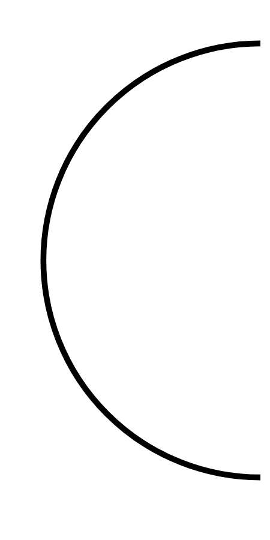

# Hasil

## Grafik

```mermaid
xychart-beta
    title "Perolehan Suara Nasional"
    x-axis []
    y-axis "Suara" 0 --> 0
    bar []
```



## Tabel

| No. | Nama Paslon | Suara | Suara (raw) | Persentase |
|:--- |:----------- | -----:| -----------:| ----------:|


[p-1]: https://github.com/gigit-pemilu/pemilu-2024/blob/main/pilpres/hitung-suara/sub/71-sulawesi-utara/sub/72-kota-bitung/sub/01-lembeh-selatan/sub/1002-paudean/sub/004-tps/sub/paslon-1.txt
[p-2]: https://github.com/gigit-pemilu/pemilu-2024/blob/main/pilpres/hitung-suara/sub/71-sulawesi-utara/sub/72-kota-bitung/sub/01-lembeh-selatan/sub/1002-paudean/sub/004-tps/sub/paslon-2.txt
[p-3]: https://github.com/gigit-pemilu/pemilu-2024/blob/main/pilpres/hitung-suara/sub/71-sulawesi-utara/sub/72-kota-bitung/sub/01-lembeh-selatan/sub/1002-paudean/sub/004-tps/sub/paslon-3.txt

## Foto C Plano

https://sirekap-obj-formc.kpu.go.id/5ded/pemilu/ppwp/71/72/01/10/02/7172011002004-20240217-132525--461df073-567f-4549-8e59-19a42fab33ef.jpg

https://sirekap-obj-formc.kpu.go.id/5ded/pemilu/ppwp/71/72/01/10/02/7172011002004-20240217-145430--79a78754-5ab6-46d2-b182-a77b813e4a0d.jpg

https://sirekap-obj-formc.kpu.go.id/5ded/pemilu/ppwp/71/72/01/10/02/7172011002004-20240217-163632--5a90d885-0ac0-4d65-8406-ad0859d012e6.jpg


## Metadata

| Key        | Value               |
| ---------- | ------------------- |
| Time Stamp | 2024-02-17 16:52:47 |


## DATA PEMILIH TETAP

Jumlah pemilih dalam DPT: **115**.
 * L: **66**.
 * P: **49**.

## DATA PENGGUNA HAK PILIH

Jumlah pengguna hak pilih dalam DPT: **101**.
 * L: **55**.
 * P: **46**.

Jumlah pengguna hak pilih dalam DPTb: **0**.
 * L: **0**.
 * P: **0**.

Jumlah pengguna hak pilih dalam DPK: **3**.
 * L: **1**.
 * P: **2**.

Jumlah pengguna hak pilih: **104**.
 * L: **56**.
 * P: **48**.

## JUMLAH SUARA SAH DAN TIDAK SAH

JUMLAH SELURUH SUARA SAH: **99**.

JUMLAH SUARA TIDAK SAH: **5**.

JUMLAH SELURUH SUARA SAH DAN SUARA TIDAK SAH: **104**.


