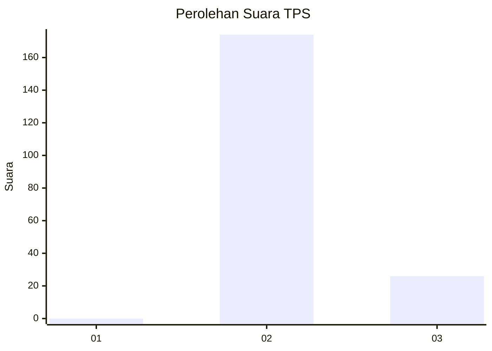
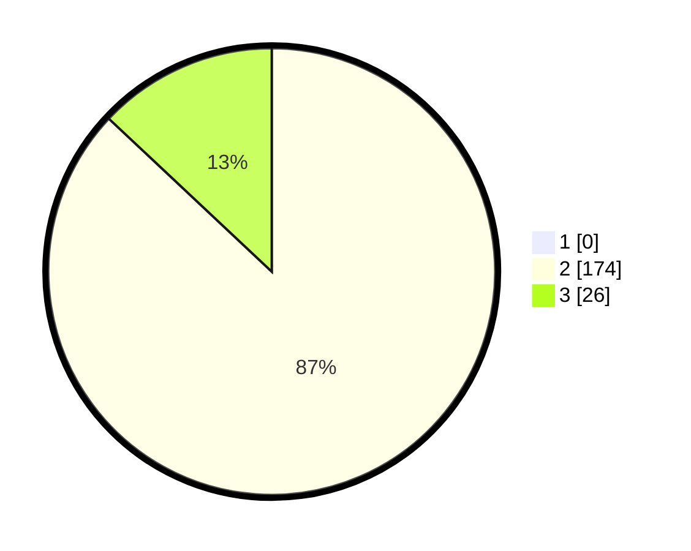

# Hasil

## Grafik

## Tabel

| No. | Nama Paslon    | Suara | Suara (raw) | Persentase |
|:--- |:-------------- | -----:| -----------:| ----------:|
| 1   | ANIES MUHAIMIN | 0     | [0][p-1]    | 0,00       |
| 2   | PRABOWO GIBRAN | 174   | [174][p-2]  | 87,00      |
| 3   | GANJAR MAHFUD  | 26    | [26][p-3]   | 13,00      |

[p-1]: https://github.com/gigit-pemilu/pemilu-2024-71-sulawesi-utara/blob/main/pilpres/hitung-suara/sub/71-sulawesi-utara/sub/72-kota-bitung/sub/02-madidir/sub/1007-madidir-unet/sub/002-tps/sub/paslon-1.txt
[p-2]: https://github.com/gigit-pemilu/pemilu-2024-71-sulawesi-utara/blob/main/pilpres/hitung-suara/sub/71-sulawesi-utara/sub/72-kota-bitung/sub/02-madidir/sub/1007-madidir-unet/sub/002-tps/sub/paslon-2.txt
[p-3]: https://github.com/gigit-pemilu/pemilu-2024-71-sulawesi-utara/blob/main/pilpres/hitung-suara/sub/71-sulawesi-utara/sub/72-kota-bitung/sub/02-madidir/sub/1007-madidir-unet/sub/002-tps/sub/paslon-3.txt

## Foto C Plano

https://sirekap-obj-formc.kpu.go.id/e543/pemilu/ppwp/71/72/02/10/07/7172021007002-20240216-102235--9076fda8-f2b6-4022-92ba-3a0fa7310b9a.jpg

https://sirekap-obj-formc.kpu.go.id/e543/pemilu/ppwp/71/72/02/10/07/7172021007002-20240216-102600--5d99db1d-39ce-485d-a091-492b92ddf3ff.jpg

https://sirekap-obj-formc.kpu.go.id/e543/pemilu/ppwp/71/72/02/10/07/7172021007002-20240216-102804--bc3a1eab-9300-47d2-9e5a-d2fe4c42d1ba.jpg

## Metadata

| Key        | Value               |
| ---------- | ------------------- |
| Time Stamp | 2024-02-16 22:30:00 |

## DATA PEMILIH TETAP

Jumlah pemilih dalam DPT: **450**.
 * L: **27**.
 * P: **823**.

## DATA PENGGUNA HAK PILIH

Jumlah pengguna hak pilih dalam DPT: **202**.
 * L: **282**.
 * P: **892**.

Jumlah pengguna hak pilih dalam DPTb: **0**.
 * L: **2**.
 * P: **2**.

Jumlah pengguna hak pilih dalam DPK: **500**.
 * L: **40**.
 * P: **400**.

Jumlah pengguna hak pilih: **0**.
 * L: **95**.
 * P: **590**.

## JUMLAH SUARA SAH DAN TIDAK SAH

JUMLAH SELURUH SUARA SAH: **200**.

JUMLAH SUARA TIDAK SAH: **0**.

JUMLAH SELURUH SUARA SAH DAN SUARA TIDAK SAH: **200**.

