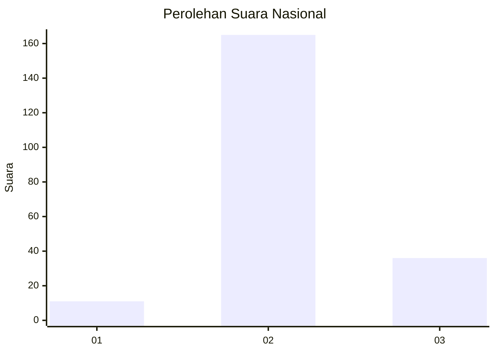

# Hasil

## Grafik

## Tabel

| No. | Nama Paslon    | Suara | Suara (raw) | Persentase |
|:--- |:-------------- | -----:| -----------:| ----------:|
| 1   | ANIES MUHAIMIN | 11    | [11][p-1]   | 5,19       |
| 2   | PRABOWO GIBRAN | 165   | [165][p-2]  | 77,83      |
| 3   | GANJAR MAHFUD  | 36    | [36][p-3]   | 16,98      |

[p-1]: https://github.com/gigit-pemilu/pemilu-2024/blob/main/pilpres/hitung-suara/sub/71-sulawesi-utara/sub/72-kota-bitung/sub/06-girian/sub/1001-girian-atas/sub/007-tps/sub/paslon-1.txt
[p-2]: https://github.com/gigit-pemilu/pemilu-2024/blob/main/pilpres/hitung-suara/sub/71-sulawesi-utara/sub/72-kota-bitung/sub/06-girian/sub/1001-girian-atas/sub/007-tps/sub/paslon-2.txt
[p-3]: https://github.com/gigit-pemilu/pemilu-2024/blob/main/pilpres/hitung-suara/sub/71-sulawesi-utara/sub/72-kota-bitung/sub/06-girian/sub/1001-girian-atas/sub/007-tps/sub/paslon-3.txt

## Foto C Plano

https://sirekap-obj-formc.kpu.go.id/e823/pemilu/ppwp/71/72/06/10/01/7172061001007-20240214-190141--c75b40cf-38cf-40d5-be77-67fb08b4852a.jpg

https://sirekap-obj-formc.kpu.go.id/e823/pemilu/ppwp/71/72/06/10/01/7172061001007-20240214-190336--94cae874-d2b0-470e-8d3b-b70812524031.jpg

https://sirekap-obj-formc.kpu.go.id/e823/pemilu/ppwp/71/72/06/10/01/7172061001007-20240214-190454--166d8f1c-29ac-4b53-99c7-18dad980e967.jpg

## Metadata

| Key        | Value               |
| ---------- | ------------------- |
| Time Stamp | 2024-02-15 00:41:44 |

