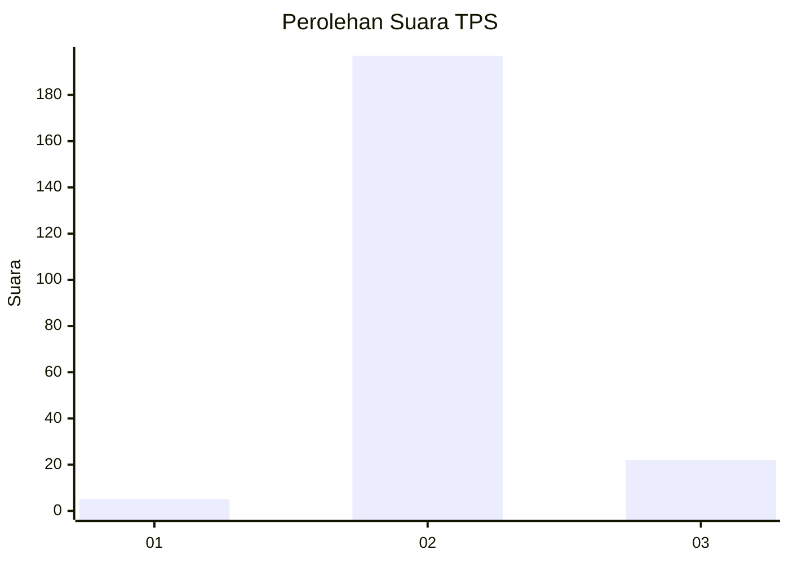
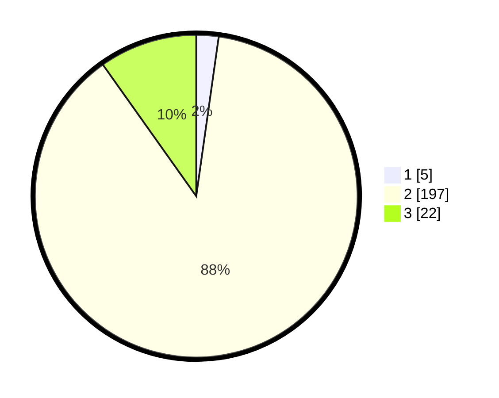

# Hasil

## Grafik

## Tabel

| No. | Nama Paslon    | Suara | Suara (raw) | Persentase |
|:--- |:-------------- | -----:| -----------:| ----------:|
| 1   | ANIES MUHAIMIN | 5     | [5][p-1]    | 2,23       |
| 2   | PRABOWO GIBRAN | 197   | [197][p-2]  | 87,95      |
| 3   | GANJAR MAHFUD  | 22    | [22][p-3]   | 9,82       |

[p-1]: https://github.com/gigit-pemilu/pemilu-2024-71-sulawesi-utara/blob/main/pilpres/hitung-suara/sub/71-sulawesi-utara/sub/73-kota-tomohon/sub/02-tomohon-tengah/sub/1009-talete-satu/sub/005-tps/sub/paslon-1.txt
[p-2]: https://github.com/gigit-pemilu/pemilu-2024-71-sulawesi-utara/blob/main/pilpres/hitung-suara/sub/71-sulawesi-utara/sub/73-kota-tomohon/sub/02-tomohon-tengah/sub/1009-talete-satu/sub/005-tps/sub/paslon-2.txt
[p-3]: https://github.com/gigit-pemilu/pemilu-2024-71-sulawesi-utara/blob/main/pilpres/hitung-suara/sub/71-sulawesi-utara/sub/73-kota-tomohon/sub/02-tomohon-tengah/sub/1009-talete-satu/sub/005-tps/sub/paslon-3.txt

## Foto C Plano

https://sirekap-obj-formc.kpu.go.id/80de/pemilu/ppwp/71/73/02/10/09/7173021009005-20240228-205959--1931e33d-eac2-453f-9e30-2776c262be04.jpg

https://sirekap-obj-formc.kpu.go.id/80de/pemilu/ppwp/71/73/02/10/09/7173021009005-20240214-192538--abbf9019-0083-41e4-8bca-c231a4d6d5a4.jpg

https://sirekap-obj-formc.kpu.go.id/80de/pemilu/ppwp/71/73/02/10/09/7173021009005-20240214-192850--352b9db2-2fb2-44bb-a027-70867e282d1e.jpg

## Metadata

| Key        | Value               |
| ---------- | ------------------- |
| Time Stamp | 2024-02-28 22:00:00 |

