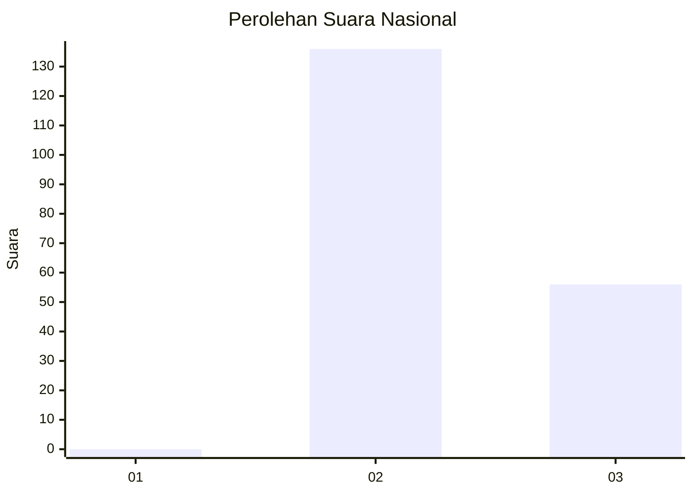
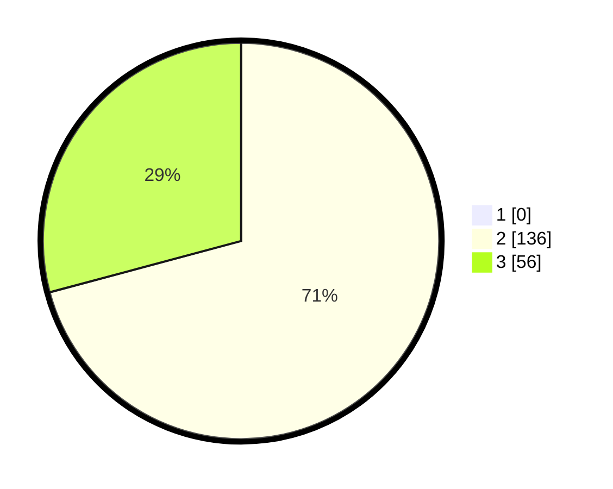

# Hasil

## Grafik

## Tabel

| No. | Nama Paslon    | Suara | Suara (raw) | Persentase |
|:--- |:-------------- | -----:| -----------:| ----------:|
| 1   | ANIES MUHAIMIN | 0     | [0][p-1]    | 0,00       |
| 2   | PRABOWO GIBRAN | 136   | [136][p-2]  | 70,83      |
| 3   | GANJAR MAHFUD  | 56    | [56][p-3]   | 29,17      |

[p-1]: https://github.com/gigit-pemilu/pemilu-2024/blob/main/pilpres/hitung-suara/sub/71-sulawesi-utara/sub/73-kota-tomohon/sub/02-tomohon-tengah/sub/1012-kolongan/sub/003-tps/sub/paslon-1.txt
[p-2]: https://github.com/gigit-pemilu/pemilu-2024/blob/main/pilpres/hitung-suara/sub/71-sulawesi-utara/sub/73-kota-tomohon/sub/02-tomohon-tengah/sub/1012-kolongan/sub/003-tps/sub/paslon-2.txt
[p-3]: https://github.com/gigit-pemilu/pemilu-2024/blob/main/pilpres/hitung-suara/sub/71-sulawesi-utara/sub/73-kota-tomohon/sub/02-tomohon-tengah/sub/1012-kolongan/sub/003-tps/sub/paslon-3.txt

## Foto C Plano

https://sirekap-obj-formc.kpu.go.id/4a46/pemilu/ppwp/71/73/02/10/12/7173021012003-20240217-211713--5f7aa7eb-a43b-4767-a465-fe2f36e0eff5.jpg

https://sirekap-obj-formc.kpu.go.id/4a46/pemilu/ppwp/71/73/02/10/12/7173021012003-20240217-211957--dc0e24dd-258f-446e-8cb4-e98f16c4324d.jpg

https://sirekap-obj-formc.kpu.go.id/4a46/pemilu/ppwp/71/73/02/10/12/7173021012003-20240217-212339--11b24a91-a7ae-449e-ad66-8672b2f23cf5.jpg

## Metadata

| Key        | Value               |
| ---------- | ------------------- |
| Time Stamp | 2024-02-19 06:16:00 |

## DATA PEMILIH TETAP

Jumlah pemilih dalam DPT: **228**.
 * L: **536**.
 * P: **112**.

## DATA PENGGUNA HAK PILIH

Jumlah pengguna hak pilih dalam DPT: **568**.
 * L: **994**.
 * P: **951**.

Jumlah pengguna hak pilih dalam DPTb: **94**.
 * L: **90**.
 * P: **4**.

Jumlah pengguna hak pilih dalam DPK: **30**.
 * L: **2**.
 * P: **2**.

Jumlah pengguna hak pilih: **692**.
 * L: **95**.
 * P: **993**.

## JUMLAH SUARA SAH DAN TIDAK SAH

JUMLAH SELURUH SUARA SAH: **192**.

JUMLAH SUARA TIDAK SAH: **0**.

JUMLAH SELURUH SUARA SAH DAN SUARA TIDAK SAH: **192**.

