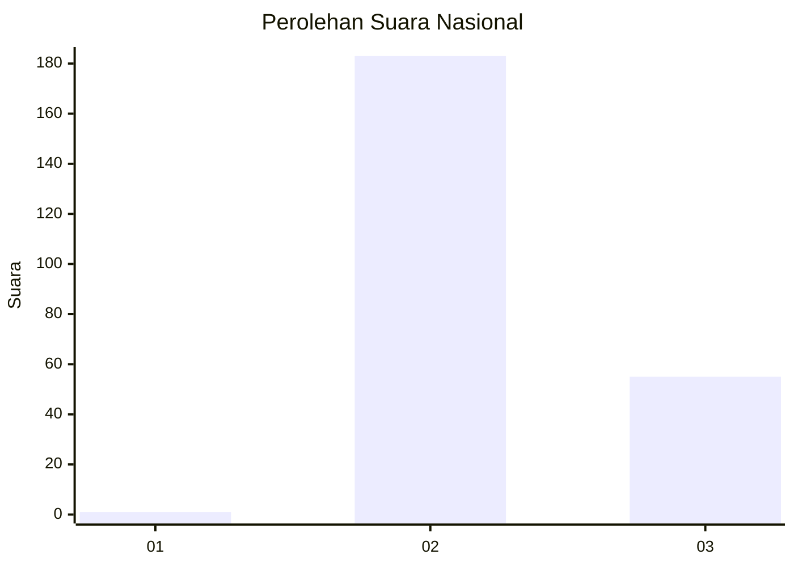
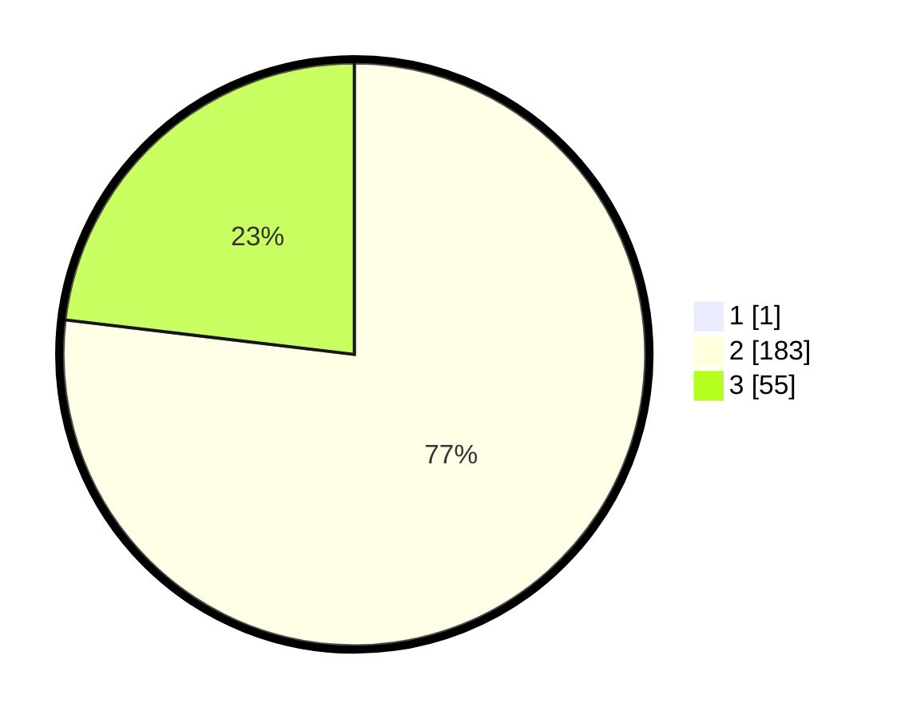

# Hasil

## Grafik

## Tabel

| No. | Nama Paslon    | Suara | Suara (raw) | Persentase |
|:--- |:-------------- | -----:| -----------:| ----------:|
| 1   | ANIES MUHAIMIN | 1     | [1][p-1]    | 0,42       |
| 2   | PRABOWO GIBRAN | 183   | [183][p-2]  | 76,57      |
| 3   | GANJAR MAHFUD  | 55    | [55][p-3]   | 23,01      |

[p-1]: https://github.com/gigit-pemilu/pemilu-2024/blob/main/pilpres/hitung-suara/sub/71-sulawesi-utara/sub/73-kota-tomohon/sub/03-tomohon-utara/sub/1001-tinoor-satu/sub/001-tps/sub/paslon-1.txt
[p-2]: https://github.com/gigit-pemilu/pemilu-2024/blob/main/pilpres/hitung-suara/sub/71-sulawesi-utara/sub/73-kota-tomohon/sub/03-tomohon-utara/sub/1001-tinoor-satu/sub/001-tps/sub/paslon-2.txt
[p-3]: https://github.com/gigit-pemilu/pemilu-2024/blob/main/pilpres/hitung-suara/sub/71-sulawesi-utara/sub/73-kota-tomohon/sub/03-tomohon-utara/sub/1001-tinoor-satu/sub/001-tps/sub/paslon-3.txt

## Foto C Plano

https://sirekap-obj-formc.kpu.go.id/d9e3/pemilu/ppwp/71/73/03/10/01/7173031001001-20240214-155354--8df36a94-9207-48ba-9681-c8eab77f324a.jpg

https://sirekap-obj-formc.kpu.go.id/d9e3/pemilu/ppwp/71/73/03/10/01/7173031001001-20240214-155406--1c5e6595-25c2-43b6-9187-9dcb8e91826d.jpg

https://sirekap-obj-formc.kpu.go.id/d9e3/pemilu/ppwp/71/73/03/10/01/7173031001001-20240215-062610--56ec65c9-0b26-4867-8352-aede31233835.jpg

## Metadata

| Key        | Value               |
| ---------- | ------------------- |
| Time Stamp | 2024-02-15 20:30:46 |

