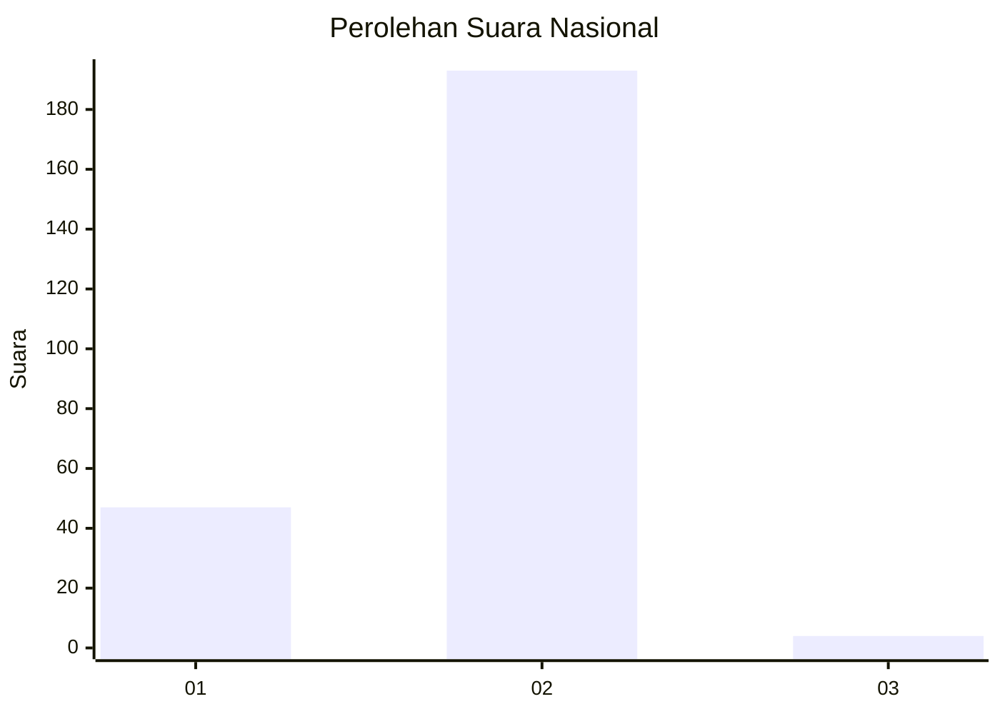
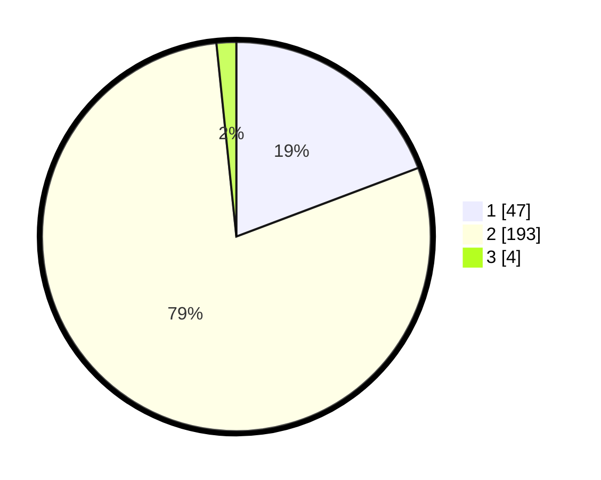

# Hasil

## Grafik

## Tabel

| No. | Nama Paslon    | Suara | Suara (raw) | Persentase |
|:--- |:-------------- | -----:| -----------:| ----------:|
| 1   | ANIES MUHAIMIN | 47    | [47][p-1]   | 19,26      |
| 2   | PRABOWO GIBRAN | 193   | [193][p-2]  | 79,10      |
| 3   | GANJAR MAHFUD  | 4     | [4][p-3]    | 1,64       |

[p-1]: https://github.com/gigit-pemilu/pemilu-2024/blob/main/pilpres/hitung-suara/sub/71-sulawesi-utara/sub/74-kota-kotamobagu/sub/03-kotamobagu-selatan/sub/1007-motoboi-kecil/sub/002-tps/sub/paslon-1.txt
[p-2]: https://github.com/gigit-pemilu/pemilu-2024/blob/main/pilpres/hitung-suara/sub/71-sulawesi-utara/sub/74-kota-kotamobagu/sub/03-kotamobagu-selatan/sub/1007-motoboi-kecil/sub/002-tps/sub/paslon-2.txt
[p-3]: https://github.com/gigit-pemilu/pemilu-2024/blob/main/pilpres/hitung-suara/sub/71-sulawesi-utara/sub/74-kota-kotamobagu/sub/03-kotamobagu-selatan/sub/1007-motoboi-kecil/sub/002-tps/sub/paslon-3.txt

## Foto C Plano

https://sirekap-obj-formc.kpu.go.id/3480/pemilu/ppwp/71/74/03/10/07/7174031007002-20240227-231603--bb6121bb-cc55-4430-a1d1-bf5f273cba49.jpg

https://sirekap-obj-formc.kpu.go.id/3480/pemilu/ppwp/71/74/03/10/07/7174031007002-20240219-134134--7215e024-687d-46a5-8203-ec00548ba160.jpg

https://sirekap-obj-formc.kpu.go.id/3480/pemilu/ppwp/71/74/03/10/07/7174031007002-20240219-134319--47ea3a1c-1073-4ee3-83de-a3b7500885a0.jpg

## Metadata

| Key        | Value               |
| ---------- | ------------------- |
| Time Stamp | 2024-02-28 00:00:00 |

