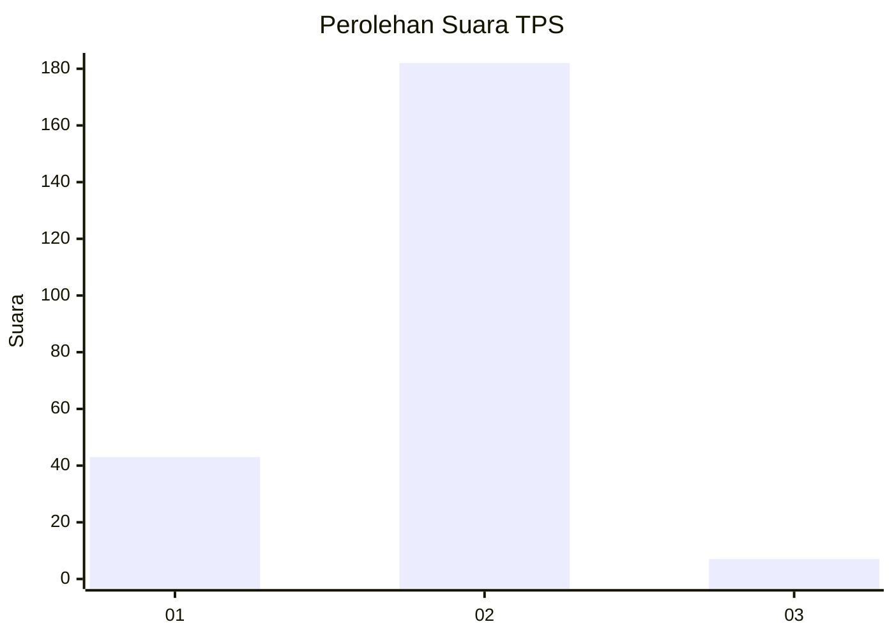
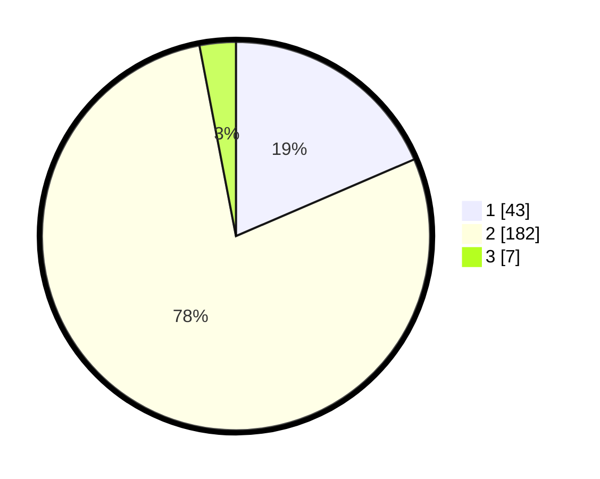

# Hasil

## Grafik

## Tabel

| No. | Nama Paslon    | Suara | Suara (raw) | Persentase |
|:--- |:-------------- | -----:| -----------:| ----------:|
| 1   | ANIES MUHAIMIN | 43    | [43][p-1]   | 18,53      |
| 2   | PRABOWO GIBRAN | 182   | [182][p-2]  | 78,45      |
| 3   | GANJAR MAHFUD  | 7     | [7][p-3]    | 3,02       |

[p-1]: https://github.com/gigit-pemilu/pemilu-2024-71-sulawesi-utara/blob/main/pilpres/hitung-suara/sub/71-sulawesi-utara/sub/74-kota-kotamobagu/sub/04-kotamobagu-barat/sub/1001-mongkonai/sub/001-tps/sub/paslon-1.txt
[p-2]: https://github.com/gigit-pemilu/pemilu-2024-71-sulawesi-utara/blob/main/pilpres/hitung-suara/sub/71-sulawesi-utara/sub/74-kota-kotamobagu/sub/04-kotamobagu-barat/sub/1001-mongkonai/sub/001-tps/sub/paslon-2.txt
[p-3]: https://github.com/gigit-pemilu/pemilu-2024-71-sulawesi-utara/blob/main/pilpres/hitung-suara/sub/71-sulawesi-utara/sub/74-kota-kotamobagu/sub/04-kotamobagu-barat/sub/1001-mongkonai/sub/001-tps/sub/paslon-3.txt

## Foto C Plano

https://sirekap-obj-formc.kpu.go.id/b6f5/pemilu/ppwp/71/74/04/10/01/7174041001001-20240224-085923--4087a3df-66c0-4a05-b09e-9b0dd2f025e9.jpg

https://sirekap-obj-formc.kpu.go.id/b6f5/pemilu/ppwp/71/74/04/10/01/7174041001001-20240224-090001--3d6838cd-70bd-4be0-aa77-a25b0173f8fc.jpg

https://sirekap-obj-formc.kpu.go.id/b6f5/pemilu/ppwp/71/74/04/10/01/7174041001001-20240224-090042--990cba7e-89e0-4f22-bf01-865566ec9968.jpg

## Metadata

| Key        | Value               |
| ---------- | ------------------- |
| Time Stamp | 2024-02-24 22:31:28 |

